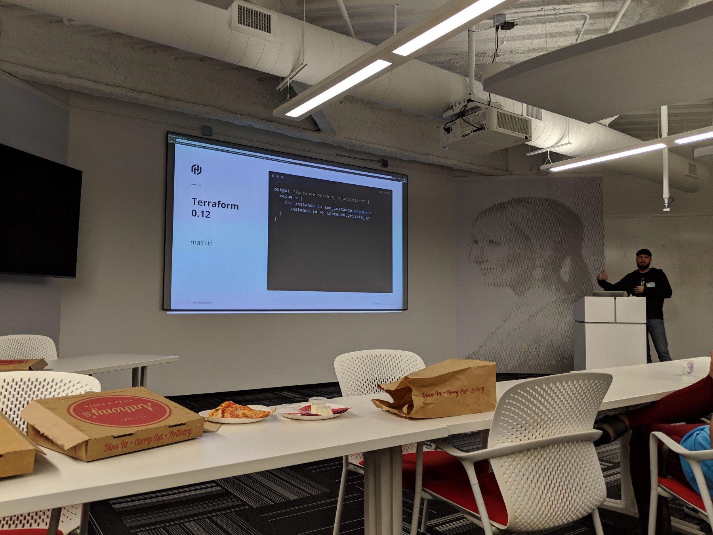

# Terraform 0.12 Examples

> This blog was originally posted [here](https://medium.com/rigged-ops/terraform-0-12-examples-c6b6770c0c0d) on Medium

I recently did a talk at the [Denver DevOps Meetup](https://www.meetup.com/DenverDevOps/) about the latest [Terraform 0.12](https://www.hashicorp.com/resources/introducing-terraform-0-12) changes, and there are a [ton](https://www.hashicorp.com/blog/terraform-0-1-2-preview)! There is a lot of great content out there already about what these changes are, but I wanted to [explore some practical, working examples](https://github.com/errygg/denver-devops-meetup/tree/dev/13mar2019) and show them to my local DevOps compadres.

Here are a few of the examples that I showed during that Meetup that I thought were worth exploring and digging into. I tried to use only local resources so I didn’t have to rely on an internet connection (thankfully, because I didn’t end up having one for the talk!). I also used my favorite resource: `[random_pet](https://www.terraform.io/docs/providers/random/r/pet.html)`!

Also, I just needed to do a quick shout out to my coworkers, [Nic Jackson](https://twitter.com/sheriffjackson) and Kristen Laemmert for letting me pilfer a bunch of their content for the talk (and this blog post).

## First-Class Expressions

The [first-class expressions](https://www.hashicorp.com/blog/terraform-0-12-preview-first-class-expressions) feature really cleans up your terraform code. Gone now are the `${...}` of Terraform 0.11. 0.12 removed the need to interpolate variables and operators as strings.

## For Expressions

Pretty self-explanatory here, but for loops in Terraform are amazing! `for`, `for_each` and dynamic nested blocks are now available for use. Here is an example in its full glory:

```hcl
variable "pet_prefixes" {
  description = "List of animal prefixes"
  default     = ["fido", "felix", "duke", "sally"]
}

resource "random_shuffle" "pet" {
  input = [
    for pet in var.pet_prefixes:
    upper(pet)
  ]
}

output "shuffled_output" {
  value = random_shuffle.pet.result
}
```

When running `terraform apply` the output is:

```shell
Apply complete! Resources: 1 added, 0 changed, 0 destroyed.
Outputs:
shuffled_output = [
  "FIDO",
  "DUKE",
  "SALLY",
  "FELIX",
]
```

## Generalized “Splat” Operator

So, it used to be that `*` would only work on resources that had a count associated with them, but now it works on any resource that is a list.

```hcl
variable "pet_prefixes" {
  description = "List of animal prefixes"
  default     = ["fido", "felix", "duke", "sally"]
}

resource "random_shuffle" "pet" {
  input = var.pet_prefixes
}

output "shuffled_output" {
  value = "${random_shuffle.pet.*.result}"
}
```

The output here can use the splat operator and we didn’t use any sort of `count`! Sweet!

Oh, also, here’s the output:

```shell
Apply complete! Resources: 1 added, 0 changed, 0 destroyed.
Outputs:
shuffled_output = [
  [
    "fido",
    "duke",
    "felix",
    "sally",
  ],
]
```

## Conditional Improvements

This one was one of the best improvements. If you have written any terraform at all, you are certainly aware of the crazy ways to do conditionals and how difficult it is to read, as well as debug. So check this out:

```hcl
variable "whose" {
  description = "Who's animal this is"
  type        = string
  # Look - you can set it to null and it works!
  default     = null
}

variable "yours_length" {
  description = "Length in words that your pet's name should be"
  type        = string
  default     = "3"
}

variable "mine_length" {
  description = "Length in words that my pet's name should be"
  type        = string
  default     = "2"
}

resource "random_pet" "pet" {
  length = (var.whose == "yours" ? var.yours_length :
            var.mine_length)
  prefix    = var.whose  separator = "-"
}

output "pet_name" {
  value = "${random_pet.pet.id}"
}
```

And the output again:

```shell
Apply complete! Resources: 1 added, 0 changed, 0 destroyed.
Outputs:
pet_name = supreme-monitor
```

## Additional Content

Here are the [slides](https://docs.google.com/presentation/d/1l4NCSzRlOsixP9STFV9kt7DhsNoJWVAQ1ig0s6bdDCQ/edit#slide=id.g54eb54762f_1_5300) and the GitHub [repo](https://github.com/errygg/denver-devops-meetup) I used for the talk. I put 0.11 and 0.12 examples in there to show the difference between them. Also, as mentioned in the README, I use a really nice tool, `tfenv` that automatically changes the version of `terraform` I’m using in each directory. [Try it out](https://github.com/tfutils/tfenv)! I plan to continue exploring and adding new content to fill out the examples that are currently stubbed out.

Additionally, Nic’s [HashiTalk](https://www.hashicorp.com/blog/hashitalks-2019) [talk](https://www.youtube.com/watch?v=4SIimMriLXg) and Kristin’s [talk](https://www.youtube.com/watch?v=U1kSAELCBDw) at HashiConf 2018 are also great resources to learn more about Terraform 0.12.
